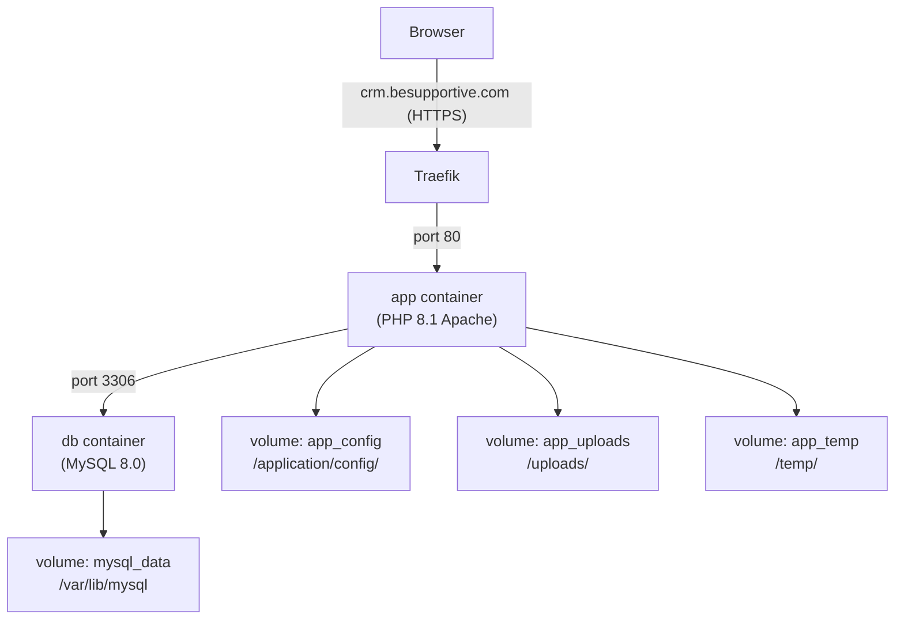

# Dockerize Perfex CRM for Dokploy

## Architecture




## Files to Create

### 1. `Dockerfile`

- Base image: `php:8.1-apache`
- Enable `mod_rewrite` and `mod_headers`
- Install PHP extensions: `pdo_mysql`, `mysqli`, `gd`, `zip`, `mbstring`, `intl`, `imap`, `opcache`, `exif`, `bcmath`, `xml`
- Copy the Apache virtual host config that sets `AllowOverride All` (required for `.htaccess` URL rewriting)
- Set `www-data` ownership and correct permissions (`775` on `uploads/`, `temp/`, `application/cache/`, `application/logs/`)

### 2. `docker/apache/perfex.conf`

Apache virtual host enabling `AllowOverride All` for the document root — this makes the existing `[.htaccess](.htaccess)` URL-rewriting work properly inside the container.

### 3. `docker-compose.yml`

- `app` service: built from `Dockerfile`, uses named volumes for persistence
- `db` service: `mysql:8.0` with healthcheck so `app` waits for DB readiness
- Named volumes: `app_config`, `app_uploads`, `app_temp`, `app_logs`, `app_cache`, `mysql_data`
- All DB credentials come from `.env`
- **No `ports:` exposed** — Dokploy's Traefik reverse proxy handles external routing

### 4. `.env.example`

Template with:

```
MYSQL_ROOT_PASSWORD=change_me
MYSQL_DATABASE=perfex_crm
MYSQL_USER=perfex
MYSQL_PASSWORD=change_me
```

You copy this to `.env` before deploying.

### 5. `.dockerignore`

Excludes `.git`, `node_modules`, `*.log`, `.env` from the build context.

---

## Key Config Details

**Why `app_config` volume?**
Docker named volumes copy image contents into the volume on first creation. So all existing config files (`config.php`, `database.php`, etc.) land in the volume, and when the `/install` wizard creates `application/config/app-config.php` it also lands in the volume — surviving container restarts and re-deploys.

**PHP extensions required by Perfex CRM:**
`pdo_mysql`, `mysqli`, `gd` (charts/PDF), `imap` (email piping for tickets), `zip`, `mbstring`, `intl`, `opcache`, `exif`, `bcmath`

---

## Deployment Workflow on Dokploy

1. Push the project (with the new Docker files) to a Git repo (GitHub/GitLab).
2. In Dokploy → **New Application** → **Docker Compose**.
3. Point to the repo, set build path to the root.
4. Set `.env` values in Dokploy's **Environment** tab (copy from `.env.example`).
5. In Dokploy's **Domains** tab: add `crm.besupportive.com`, select `app` service on port `80`, enable **Let's Encrypt** — Dokploy + Traefik auto-provisions SSL.
6. Deploy. Then navigate to `https://crm.besupportive.com/install`.
7. During the wizard, use `db` as the **Database Hostname** (the Docker service name, not `localhost`).
8. Complete the wizard. After success — exec into the container and remove the `/install` folder:

```bash
   docker exec -it perfex_app rm -rf /var/www/html/install
   

```

---

## Post-Install DNS Setup

Point your domain's A record at your Dokploy VPS IP:

```
crm.besupportive.com  A  <your-vps-ip>
```

